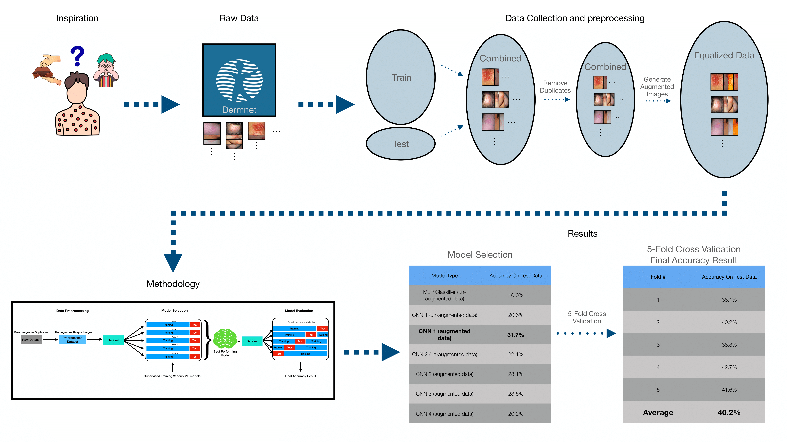

# Skin_Disease_Detection_ML

This code repository holds a data science project that explores the accuracy of training and testing different ML models on the Dermnet skin disease image collection.

The following infographic represents the essence of the project:

An expanded version of the methodology section:

